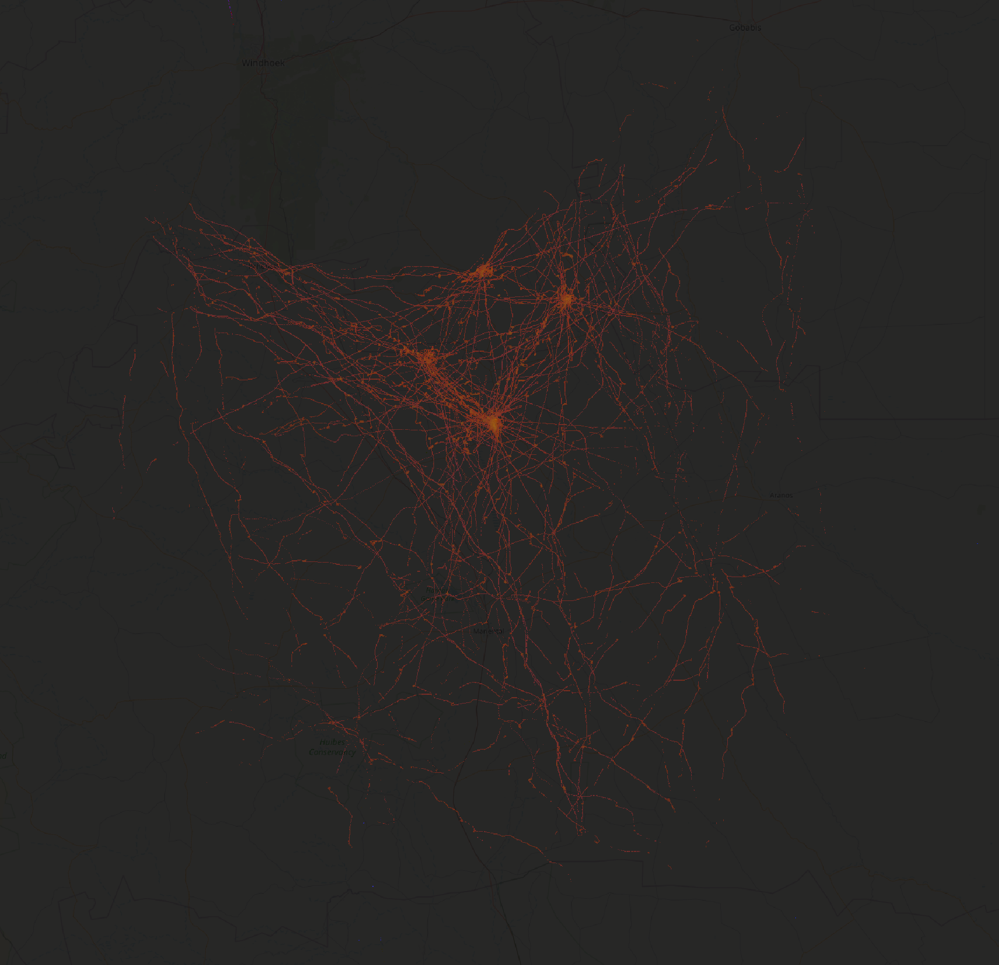

# ADS-B Massive Visualizer

This website (technology demo) allows you to aggregate and visualize massive amounts of air traffic data. The data is hosted in a [ClickHouse](https://github.com/ClickHouse/ClickHouse/) database and queried on the fly. You can tune the visualizations with custom SQL queries and drill-down from 50 billion records to individual data records.

## Examples

The visualization is insanely beautiful.

### [Helicopters over Manhattan:](https://adsb.exposed/?zoom=12&lat=40.7168&lng=285.9893&query=e18e8c8d6a1db73c63953798ad8919a9)
[](https://adsb.exposed/?zoom=12&lat=40.7168&lng=285.9893&query=e18e8c8d6a1db73c63953798ad8919a9)

### [Denver airport:](https://adsb.exposed/?zoom=11&lat=39.8665&lng=255.3566&query=dd3c1af70baafa35055b06fa3556d96e)
[](https://adsb.exposed/?zoom=11&lat=39.8665&lng=255.3566&query=dd3c1af70baafa35055b06fa3556d96e)


If we zoom into a single airport, we can see where the planes are parked and even color them by a manufacturer or an airline:

### [Denver airport:](https://adsb.exposed/?zoom=15&lat=39.8592&lng=255.3276&query=b4659aba93f0e495ef2aa837ee793874)
[](https://adsb.exposed/?zoom=15&lat=39.8592&lng=255.3276&query=b4659aba93f0e495ef2aa837ee793874)

### [Amsterdam Schiphol](https://adsb.exposed/?zoom=14&lat=52.3103&lng=364.7577&query=b4659aba93f0e495ef2aa837ee793874)

### [Denver by airlines](https://adsb.exposed/?zoom=14&lat=39.8629&lng=255.3427&query=685c788488edb2e156049a356f0f5cf1)
### [Schiphol by airlines](https://adsb.exposed/?zoom=14&lat=52.3103&lng=364.7577&query=685c788488edb2e156049a356f0f5cf1)


You can select only military airplanes and find military bases and airfields.

### [Military training in Texas:](https://adsb.exposed/?zoom=7&lat=32.1944&lng=261.9682&query=64acf6eb47ad04237460ef46873f3bc3)
[](https://adsb.exposed/?zoom=7&lat=32.1944&lng=261.9682&query=64acf6eb47ad04237460ef46873f3bc3)

### [Military training in Langley:](https://adsb.exposed/?zoom=8&lat=37.7408&lng=285.7004&query=64acf6eb47ad04237460ef46873f3bc3)
[](https://adsb.exposed/?zoom=8&lat=37.7408&lng=285.7004&query=64acf6eb47ad04237460ef46873f3bc3)


You can select only Helicopters and find hospitals and police stations.

### [VUMC in Amsterdam:](https://adsb.exposed/?zoom=12&lat=52.3446&lng=4.8814&query=e18e8c8d6a1db73c63953798ad8919a9)
[](https://adsb.exposed/?zoom=12&lat=52.3446&lng=4.8814&query=e18e8c8d6a1db73c63953798ad8919a9)

### [In London, helicopters fly over the river:](https://adsb.exposed/?zoom=12&lat=51.5079&lng=359.8960&query=e18e8c8d6a1db73c63953798ad8919a9)
[](https://adsb.exposed/?zoom=12&lat=51.5079&lng=359.8960&query=e18e8c8d6a1db73c63953798ad8919a9)

### [In Las Vegas there is no river:](https://adsb.exposed/?zoom=10&lat=36.1374&lng=244.8811&query=e18e8c8d6a1db73c63953798ad8919a9)
[](https://adsb.exposed/?zoom=10&lat=36.1374&lng=244.8811&query=e18e8c8d6a1db73c63953798ad8919a9)


Gliders are also interesting.

### [Gliders in Netherlands near Utrecht:](https://adsb.exposed/?zoom=11&lat=52.1407&lng=5.3043&query=d0df937d8c601cb73c7e4721bea5b7f9)
[](https://adsb.exposed/?zoom=11&lat=52.1407&lng=5.3043&query=d0df937d8c601cb73c7e4721bea5b7f9)

### [Gliders near Denver:](https://adsb.exposed/?zoom=9&lat=39.6691&lng=255.2838&query=d0df937d8c601cb73c7e4721bea5b7f9)
[](https://adsb.exposed/?zoom=9&lat=39.6691&lng=255.2838&query=d0df937d8c601cb73c7e4721bea5b7f9)


Small airports are beautiful.

### [Bay Area small airports:](https://adsb.exposed/?zoom=9&lat=37.8100&lng=238.0987&query=045cd07e7640e0b6b0d10cf0fd80282c)
[](https://adsb.exposed/?zoom=9&lat=37.8100&lng=238.0987&query=045cd07e7640e0b6b0d10cf0fd80282c)

### [Dallas small airports:](https://adsb.exposed/?zoom=9&lat=32.9119&lng=262.9988&query=045cd07e7640e0b6b0d10cf0fd80282c)
[](https://adsb.exposed/?zoom=9&lat=32.9119&lng=262.9988&query=045cd07e7640e0b6b0d10cf0fd80282c)


F-16 military training:

### [F-16 air bases in the US:](https://adsb.exposed/?zoom=5&lat=37.0900&lng=267.1385&query=b8af6c7320f23c451d629cea6ae21826)
[](https://adsb.exposed/?zoom=5&lat=37.0900&lng=267.1385&query=b8af6c7320f23c451d629cea6ae21826)

### [F-16 training in Langley:](https://adsb.exposed/?zoom=8&lat=37.4530&lng=284.7047&query=b8af6c7320f23c451d629cea6ae21826)
[](https://adsb.exposed/?zoom=8&lat=37.4530&lng=284.7047&query=b8af6c7320f23c451d629cea6ae21826)

### [F-16 training in Belgium:](https://adsb.exposed/?zoom=9&lat=51.3529&lng=365.6607&query=b8af6c7320f23c451d629cea6ae21826)
[](https://adsb.exposed/?zoom=9&lat=51.3529&lng=365.6607&query=b8af6c7320f23c451d629cea6ae21826)


It is interesting to explore strange gaps in the map.

### [Guess what it is?](https://adsb.exposed/?zoom=7&lat=55.5040&lng=20.2597&query=dd3c1af70baafa35055b06fa3556d96e)
[](https://adsb.exposed/?zoom=7&lat=55.5040&lng=20.2597&query=dd3c1af70baafa35055b06fa3556d96e)

### [Polish air base](https://adsb.exposed/?zoom=11&lat=54.4764&lng=17.1181&query=dd3c1af70baafa35055b06fa3556d96e)

### [Maroc air base](https://adsb.exposed/?zoom=8&lat=32.7553&lng=352.4367&query=dd3c1af70baafa35055b06fa3556d96e)

### [A strange hole near Mexico City:](https://adsb.exposed/?zoom=9&lat=19.1139&lng=261.3813&query=dd3c1af70baafa35055b06fa3556d96e)
[](https://adsb.exposed/?zoom=9&lat=19.1139&lng=261.3813&query=dd3c1af70baafa35055b06fa3556d96e)

### [A volcano:](https://adsb.exposed/?zoom=8&lat=28.2122&lng=343.5701&query=dd3c1af70baafa35055b06fa3556d96e)
[](https://adsb.exposed/?zoom=8&lat=28.2122&lng=343.5701&query=dd3c1af70baafa35055b06fa3556d96e)


Balloons and dirigibles are nice.

### [Indianapolis Balloons:](https://adsb.exposed/?zoom=9&lat=39.6839&lng=274.1898&query=55edbfc4030fa2a5d11e18381f45714a)
[](https://adsb.exposed/?zoom=9&lat=39.6839&lng=274.1898&query=55edbfc4030fa2a5d11e18381f45714a)

### [Project Loon:](https://adsb.exposed/?zoom=8&lat=42.9855&lng=-97.7970&query=070d5c852982451a4a591adf1e843fc1)
[](https://adsb.exposed/?zoom=8&lat=42.9855&lng=-97.7970&query=070d5c852982451a4a591adf1e843fc1)

### [Balloons over Alps:](https://adsb.exposed/?zoom=7&lat=46.3773&lng=10.1954&query=957e06792b3f21de990ea5e7d3b41555)
[](https://adsb.exposed/?zoom=7&lat=46.3773&lng=10.1954&query=957e06792b3f21de990ea5e7d3b41555)

### [Zeppelin:](https://adsb.exposed/?zoom=10&lat=40.9685&lng=278.6968&query=d802a21e0db720c55aabe9d5f7503f06&box=41.0931,278.4670,41.0569,278.5219)
[](https://adsb.exposed/?zoom=10&lat=40.9685&lng=278.6968&query=d802a21e0db720c55aabe9d5f7503f06&box=41.0931,278.4670,41.0569,278.5219)

### [Zeppelin in LA:](https://adsb.exposed/?zoom=9&lat=33.7335&lng=242.2996&query=d802a21e0db720c55aabe9d5f7503f06)
[](https://adsb.exposed/?zoom=9&lat=33.7335&lng=242.2996&query=d802a21e0db720c55aabe9d5f7503f06)


### [Emirates Engineering:](https://adsb.exposed/?zoom=15&lat=25.2518&lng=55.3630&query=b4659aba93f0e495ef2aa837ee793874)

In Dubai Airport, the green hairball is a hangar of Emirates Engineering where Airbuses are maintained:
[](https://adsb.exposed/?zoom=15&lat=25.2518&lng=55.3630&query=b4659aba93f0e495ef2aa837ee793874)

### [Patroling in Israel:](https://adsb.exposed/?zoom=9&lat=31.1092&lng=34.8488&query=685c788488edb2e156049a356f0f5cf1)

In Israel, there are strange patterns made by patrolling drones:
[](https://adsb.exposed/?zoom=9&lat=31.1092&lng=34.8488&query=685c788488edb2e156049a356f0f5cf1)

### [Namibia air club:](https://adsb.exposed/?zoom=9&lat=-24.1889&lng=17.9942&query=dd3c1af70baafa35055b06fa3556d96e)

In Namibia, there is a nice air club:
[](https://adsb.exposed/?zoom=9&lat=-24.1889&lng=17.9942&query=dd3c1af70baafa35055b06fa3556d96e)

Near Toulouse, France, Airbus A-380 does its test flights:

### [A-380 in Toulouse:](https://adsb.exposed/?zoom=8&lat=44.4260&lng=359.5055&query=86f1300b002f59fdabd60da7ffb116b3)
[](https://adsb.exposed/?zoom=8&lat=44.4260&lng=359.5055&query=86f1300b002f59fdabd60da7ffb116b3)

### [Cognac Air Base:](https://adsb.exposed/?zoom=8&lat=45.7907&lng=359.7197&query=64acf6eb47ad04237460ef46873f3bc3)
[](https://adsb.exposed/?zoom=8&lat=45.7907&lng=359.7197&query=64acf6eb47ad04237460ef46873f3bc3)

### [Area 51:](https://adsb.exposed/?zoom=8&lat=37.2784&lng=243.9184&query=dd3c1af70baafa35055b06fa3556d96e)
[](https://adsb.exposed/?zoom=8&lat=37.2784&lng=243.9184&query=dd3c1af70baafa35055b06fa3556d96e)

### [CFB Suffield:](https://adsb.exposed/?zoom=8&lat=50.4262&lng=249.4501&query=dd3c1af70baafa35055b06fa3556d96e)


### [Airlines all over Europe:](https://adsb.exposed/?zoom=5&lat=51.0966&lng=10.3271&query=e9f7cdd454ff0473b47d750316976179)

By editing the SQL query you can color every airline with its own color.
[](https://adsb.exposed/?zoom=5&lat=51.0966&lng=10.3271&query=e9f7cdd454ff0473b47d750316976179)

### [Airlines in Denver airport:](https://adsb.exposed/?zoom=16&lat=39.8583&lng=255.3277&query=e9f7cdd454ff0473b47d750316976179)
[](https://adsb.exposed/?zoom=16&lat=39.8583&lng=255.3277&query=e9f7cdd454ff0473b47d750316976179)


### [War:](https://adsb.exposed/?zoom=5&lat=53.5142&lng=18.8965&query=a3ad1397b4d525a5a6b329253635cda6)

Analyzing a single airline we can see how the war affected the air traffic.
[](https://adsb.exposed/?zoom=5&lat=53.5142&lng=18.8965&query=a3ad1397b4d525a5a6b329253635cda6)


### [Police:](https://adsb.exposed/?zoom=10&lat=45.4408&lng=237.4369&query=250e73f7f543ab8c92bd158ea65d666a)

There are interesting examples of single aircrafts:
[](https://adsb.exposed/?zoom=10&lat=45.4408&lng=237.4369&query=250e73f7f543ab8c92bd158ea65d666a)


### [An-124:](https://adsb.exposed/?zoom=5&lat=49.7263&lng=372.8327&query=34a85d5a6486168faa995976917d18f9)

An-124 is a beautiful cargo plane, and you can find many of them in Leipzig:
[](https://adsb.exposed/?zoom=5&lat=49.7263&lng=372.8327&query=34a85d5a6486168faa995976917d18f9)

But DC-3 is unanimously the best:

### [DC-3:](https://adsb.exposed/?zoom=9&lat=52.2244&lng=4.6732&query=0cb467701aab3ea9d81e9d45f9053a56&box=52.4999,5.4030,52.3978,5.5899)
[](https://adsb.exposed/?zoom=9&lat=52.2244&lng=4.6732&query=0cb467701aab3ea9d81e9d45f9053a56&box=52.4999,5.4030,52.3978,5.5899)


## Data Source

ADS-B (Automatic Dependent Surveillance–Broadcast) is a radio protocol that is used to broadcast the data such as coordinates, altitude and velocity, and plenty of other interesting data. It is broadcast by "transponders" installed on airplanes (and not only planes). This protocol is unencrypted and there are no restrictions for collecting, using, or redistributing this data. Most passenger airplanes are obligated to broadcast this data, and in certain countries, even gliders, drones, and airport ground vehicles. Military and private light aircrafts might broadcast or not broadcast the data.

It is possible to collect this data out of thin air using your own radio receiver (e.g., in the form of SDR), although your receiver will see the data only in a certain range of your location. There are platforms for sharing and exchange of this data. Some of these platforms invite participants to share the data but restrict its redistribution by providing commercial access to it. While the source data, broadcast by airplanes, is essentially public domain, the companies may produce and license derivative works from this data.

We use the data from two sources: [ADSB.lol](https://www.adsb.lol/) (full historical data is provided without restrictions: 30..50 million records per day, available since 2023) and [ADSB-Exchange](https://www.adsbexchange.com/products/historical-data/) (only provides samples of data from first day of each month: around 1.2 billion records per day with better coverage).

Contains information from [ADSB.lol](https://www.adsb.lol/), which is made available here under the [Open Database License (ODbL)](https://github.com/adsblol/globe_history_2024/blob/main/LICENSE-ODbL.txt).

## Implementation Details

The website is implemented as a single HTML page. It does not use JavaScript frameworks and the source code is not minified, so you can easily [read it](https://github.com/ClickHouse/adsb.exposed/blob/main/index.html).

### Rendering the Map

It uses a [Leaflet](https://github.com/Leaflet/Leaflet/) library to display the map. It adds two layers to the map. The background layer uses tiles from OpenStreetMap for a usual geographic map. The main layer overlays the visualization on top of the background map.

The visualization layer uses a `GridLayer` with a custom callback function `createTile` which generates Canvas elements on the fly:

```
L.GridLayer.ClickHouse = L.GridLayer.extend({
    createTile: function(coords, done) {
        let tile = L.DomUtil.create('canvas', 'leaflet-tile');
        tile.width = 1024;
        tile.height = 1024;
        render(this.options.table, this.options.priority, coords, tile).then(err => done(err, tile));
        return tile;
    }
});

const layer_options = {
    tileSize: 1024,
    minZoom: 2,
    maxZoom: 19,
    minNativeZoom: 2,
    maxNativeZoom: 16,
    attribution: '© Alexey Milovidov, ClickHouse, Inc. (data: adsb.lol, adsbexchange.com)'
};
```

It uses tiles of 1024x1024 size for high resolution and to lower the number of requests to the database.

The rendering function performs a request to ClickHouse using its HTTP API with the JavaScript's `fetch` function:

```
const query_id = `${uuid}-${query_sequence_num}-${table}-${coords.z - 2}-${coords.x}-${coords.y}`;
const hosts = getHosts(key);
const url = host => `${host}/?user=website&default_format=RowBinary` +
    `&query_id=${query_id}&replace_running_query=1` +
    `&param_table=${table}&param_sampling=${[0, 100, 10, 1][priority]}` +
    `&param_z=${coords.z - 2}&param_x=${coords.x}&param_y=${coords.y}`;

progress_update_period = 1;
const response = await Promise.race(hosts.map(host => fetch(url(host), { method: 'POST', body: sql })));
```

The SQL query can be edited by a user on the fly using a form on the page to adjust the visualization. It is a parameterized query, accepting tile coordinates (x, y) and zoom level as parameters.

The query returns RGBA values of each pixel of the image in the `RowBinary` format (1024x1024 pixels, 1048576 rows, 4 bytes each, 4 MiB in total for each tile). It uses `zstd` compression in HTTP response as long as the browser supports it. It was a nice observation that `zstd` compression over raw pixels bitmap works better than `PNG`! (not surprising, though).

Most of the time the image data compresses several times. But anyway, hundreds of megabytes have to be transferred over the network. That's why the service can feel slow on bad Internet connections.

```
let ctx = tile.getContext('2d');
let image = ctx.createImageData(1024, 1024, {colorSpace: 'display-p3'});
let arr = new Uint8ClampedArray(buf);

for (let i = 0; i < 1024 * 1024 * 4; ++i) { image.data[i] = arr[i]; }

ctx.putImageData(image, 0, 0, 0, 0, 1024, 1024);
```

The data is put on the canvas and returned. We use the "Display P3" color space to have a wider gamut in supporting browsers.

We use three different tables with different levels of detail: `planes_mercator` contains 100% of the data, `planes_mercator_sample10` contains 10% of the data, and `planes_mercator_sample100` contains 1% of the data. The loading starts with a 1% sample to provide instant response even while rendering the whole world. After loading the first level of detail, it continues to the next level of 10%, and then it continues with 100% of the data. This gives a nice effect of progressive loading.

The image data is also cached on the client simply in a JavaScript object:

```
if (!cached_tiles[key]) cached_tiles[key] = [];

/// If there is a higer-detail tile, skip rendering of this level of detal.
if (cached_tiles[key][priority + 1]) return;

buf = cached_tiles[key][priority];
```

The downside is that after browsing for a certain time, the page will eat too much memory.

### Database and Queries

The database is pretty small by ClickHouse standards. It has 44.47 billion rows in the `planes_mercator` table as of Mar 29th, 2024, and is continuously updated with new records. It takes 1.6 TB of disk space.

The table schema is as follows (you can read it in the [setup.sql](https://github.com/ClickHouse/adsb.exposed/blob/main/setup.sql) source):
```
CREATE TABLE planes_mercator
(
    mercator_x UInt32 MATERIALIZED 0xFFFFFFFF * ((lon + 180) / 360),
    mercator_y UInt32 MATERIALIZED 0xFFFFFFFF * (1/2 - log(tan((lat + 90) / 360 * pi())) / 2 / pi()),

    INDEX idx_x (mercator_x) TYPE minmax,
    INDEX idx_y (mercator_y) TYPE minmax,

    time DateTime64(3),
    date Date,
    icao String,
    r String,
    t LowCardinality(String),
    dbFlags Int32,
    noRegData Bool,
    ownOp LowCardinality(String),
    year UInt16,
    desc LowCardinality(String),
    lat Float64,
    lon Float64,
    altitude Int32,
    ground_speed Float32,
    track_degrees Float32,
    flags UInt32,
    vertical_rate Int32,
    aircraft_alert Int64,
    aircraft_alt_geom Int64,
    aircraft_gva Int64,
    aircraft_nac_p Int64,
    aircraft_nac_v Int64,
    aircraft_nic Int64,
    aircraft_nic_baro Int64,
    aircraft_rc Int64,
    aircraft_sda Int64,
    aircraft_sil Int64,
    aircraft_sil_type LowCardinality(String),
    aircraft_spi Int64,
    aircraft_track Float64,
    aircraft_type LowCardinality(String),
    aircraft_version Int64,
    aircraft_category Enum8(
        'A0', 'A1', 'A2', 'A3', 'A4', 'A5', 'A6', 'A7',
        'B0', 'B1', 'B2', 'B3', 'B4', 'B5', 'B6', 'B7',
        'C0', 'C1', 'C2', 'C3', 'C4', 'C5', 'C6', 'C7',
        'D0', 'D1', 'D2', 'D3', 'D4', 'D5', 'D6', 'D7',
        ''),
    aircraft_emergency Enum8('', 'none', 'general', 'downed', 'lifeguard', 'minfuel', 'nordo', 'unlawful', 'reserved'),
    aircraft_flight LowCardinality(String),
    aircraft_squawk String,
    aircraft_baro_rate Int64,
    aircraft_nav_altitude_fms Int64,
    aircraft_nav_altitude_mcp Int64,
    aircraft_nav_modes Array(Enum8('althold', 'approach', 'autopilot', 'lnav', 'tcas', 'vnav')),
    aircraft_nav_qnh Float64,
    aircraft_geom_rate Int64,
    aircraft_ias Int64,
    aircraft_mach Float64,
    aircraft_mag_heading Float64,
    aircraft_oat Int64,
    aircraft_roll Float64,
    aircraft_tas Int64,
    aircraft_tat Int64,
    aircraft_true_heading Float64,
    aircraft_wd Int64,
    aircraft_ws Int64,
    aircraft_track_rate Float64,
    aircraft_nav_heading Float64,
    source LowCardinality(String),
    geometric_altitude Int32,
    geometric_vertical_rate Int32,
    indicated_airspeed Int32,
    roll_angle Float32
) ENGINE = MergeTree ORDER BY (mortonEncode(mercator_x, mercator_y), time);
```

It contains `lat` and `lon` columns with coordinates, and we use `MATERIALIZED` columns to automatically convert them to coordinates in the [Web-Mercator projection](https://en.wikipedia.org/wiki/Web_Mercator_projection), which is used by the Leaflet software and most of the maps on the Internet. The Mercator coordinates are stored in UInt32 which makes it easy to do arithmetics with tile coordinates and zoom levels in a SQL query.

The table is sorted by a [Morton Curve](https://clickhouse.com/docs/en/sql-reference/functions/encoding-functions#mortonencode) of Web Mercator coordinates, and we defined a [minmax index](https://clickhouse.com/docs/en/optimize/skipping-indexes) on them - this is how queries for certain tiles will read only the requested data.

We create level-of-detail tables with [Materialized Views](https://clickhouse.com/docs/en/guides/developer/cascading-materialized-views), so they are calculated automatically:

```
CREATE TABLE planes_mercator_sample10 AS planes_mercator;
CREATE TABLE planes_mercator_sample100 AS planes_mercator;

CREATE MATERIALIZED VIEW view_sample10 TO planes_mercator_sample10 AS SELECT * FROM planes_mercator WHERE rand() % 10 = 0;
CREATE MATERIALIZED VIEW view_sample100 TO planes_mercator_sample100 AS SELECT * FROM planes_mercator WHERE rand() % 100 = 0;
```

We use a service on our staging environment in [ClickHouse Cloud](https://clickhouse.com/cloud). The staging environment is used to test new ClickHouse versions and new types of infrastructure that we implement. For example, we can try different types of machines, and different scales of the service, or we can test new features, such as distributed cache, that are in development. Also, the staging environment uses fault injection: we interrupt network connections with a certain probability to ensure that the service operates normally. It uses chaos engineering: we terminate various machines of clickhouse-server and clickhouse-keeper at random, and also randomly scale the service back and forth to a different number of machines. This is how this project facilitates the development and testing of our service.

We also created a backup service and we are making requests to both of them concurrently. Whichever service returns first, will be used. This is how we can avoid downtime while still using our staging environment.

Let's take a look at an SQL query for the "Boeing vs. Airbus" visualization:

```
WITH
    bitShiftLeft(1::UInt64, {z:UInt8}) AS zoom_factor,
    bitShiftLeft(1::UInt64, 32 - {z:UInt8}) AS tile_size,

    tile_size * {x:UInt16} AS tile_x_begin,
    tile_size * ({x:UInt16} + 1) AS tile_x_end,

    tile_size * {y:UInt16} AS tile_y_begin,
    tile_size * ({y:UInt16} + 1) AS tile_y_end,

    mercator_x >= tile_x_begin AND mercator_x < tile_x_end
    AND mercator_y >= tile_y_begin AND mercator_y < tile_y_end AS in_tile,

    bitShiftRight(mercator_x - tile_x_begin, 32 - 10 - {z:UInt8}) AS x,
    bitShiftRight(mercator_y - tile_y_begin, 32 - 10 - {z:UInt8}) AS y,

    y * 1024 + x AS pos,

    count() AS total,
    sum(desc LIKE 'BOEING%') AS boeing,
    sum(desc LIKE 'AIRBUS%') AS airbus,
    sum(NOT (desc LIKE 'BOEING%' OR desc LIKE 'AIRBUS%')) AS other,

    greatest(1000000 DIV {sampling:UInt32} DIV zoom_factor, total) AS max_total,
    greatest(1000000 DIV {sampling:UInt32} DIV zoom_factor, boeing) AS max_boeing,
    greatest(1000000 DIV {sampling:UInt32} DIV zoom_factor, airbus) AS max_airbus,
    greatest(1000000 DIV {sampling:UInt32} DIV zoom_factor, other) AS max_other,

    pow(total / max_total, 1/5) AS transparency,

    255 * (1 + transparency) / 2 AS alpha,
    pow(boeing, 1/5) * 256 DIV (1 + pow(max_boeing, 1/5)) AS red,
    pow(airbus, 1/5) * 256 DIV (1 + pow(max_airbus, 1/5)) AS green,
    pow(other, 1/5) * 256 DIV (1 + pow(max_other, 1/5)) AS blue

SELECT round(red)::UInt8, round(green)::UInt8, round(blue)::UInt8, round(alpha)::UInt8
FROM {table:Identifier}
WHERE in_tile
GROUP BY pos ORDER BY pos WITH FILL FROM 0 TO 1024*1024
```

It uses the `WITH` clause to define aliases for various expressions. It uses type-safe parameters (x, y, z, sampling, table) for [parameterized queries](https://clickhouse.com/docs/en/sql-reference/syntax#defining-and-using-query-parameters).

The first part of the query calculates the condition `in_tile` which is used in the `WHERE` section to filter the data in the requested tile. Then it calculates the colors: alpha, red, green, and blue. They are adjusted by the `pow` function for better uniformity, clamped to the 0..255 range, and converted to `UInt8`. The sampling parameter is used for adjustment in a way so that queries with a lower level of detail will return pictures with mostly the same relative colors. We group by the pixel coordinate `pos` and also use the [`WITH FILL` modifier](https://clickhouse.com/docs/en/sql-reference/statements/select/order-by#order-by-expr-with-fill-modifier) in the ORDER BY to fill zeros in the pixel positions that have no data. As a result, we will get an RGBA bitmap with the exact 1024x1024 size.

### Reports

If you select an area with the right mouse button or use a selection tool, it will generate a report from the database for the selection area. This is entirely straightforward. For example, here is a query for the top aircraft types:

```
const sql_types = `
    WITH mercator_x >= {left:UInt32} AND mercator_x < {right:UInt32}
        AND mercator_y >= {top:UInt32} AND mercator_y < {bottom:UInt32} AS in_tile
    SELECT t, anyIf(desc, desc != '') AS desc, count() AS c
    FROM {table:Identifier}
    WHERE t != '' AND ${condition}
    GROUP BY t
    ORDER BY c DESC
    LIMIT 100`;
```

The report is calculated for flight numbers, aircraft types, registration (tail numbers), and owners. You can click on any item and it will apply a filter to the main SQL query. For example, click on `A388` and it will show you a visualization for Airbus 380-800.

As a bonus, if you move the cursor over an aircraft type, it will go to Wikipedia API and try to find a picture of this aircraft. It often finds something else on Wikipedia, though.

### Saved Queries

You can edit a query and then share a link. The query is converted to a 128-bit hash and saved in the same ClickHouse database:

```
async function saveQuery(text) {
    const sql = `INSERT INTO saved_queries (text) FORMAT RawBLOB`;
    const hosts = getHosts(null);
    const url = host => `${host}/?user=website_saved_queries&query=${encodeURIComponent(sql)}`;
    const response = await Promise.all(hosts.map(host => fetch(url(host), { method: 'POST', body: text })));
}

async function loadQuery(hash) {
    const sql = `SELECT text FROM saved_queries WHERE hash = unhex({hash:String}) LIMIT 1`;
    const hosts = getHosts(null);
    const url = host => `${host}/?user=website_saved_queries&default_format=JSON&param_hash=${hash}`;
    const response = await Promise.race(hosts.map(host => fetch(url(host), { method: 'POST', body: sql })));
    const data = await response.json();
    return data.data[0].text;
}
```

We use a different user `website_saved_queries` with different access control and quotas for these queries.

### Progress Bar

It is nice to display a progress bar with the amount of data processed in rows and bytes.

```
const sql = `SELECT
            sum(read_rows) AS r,
            sum(total_rows_approx) AS t,
            sum(read_bytes) AS b,
            r / max(elapsed) AS rps,
            b / max(elapsed) AS bps,
            formatReadableQuantity(r) AS formatted_rows,
            formatReadableSize(b) AS formatted_bytes,
            formatReadableQuantity(rps) AS formatted_rps,
            formatReadableSize(bps) AS formatted_bps
        FROM clusterAllReplicas(default, system.processes)
        WHERE user = 'website' AND startsWith(query_id, {uuid:String})`;

    const hosts = getHosts(uuid);
    const url = host => `${host}/?user=website_progress&default_format=JSON&param_uuid=${uuid}`;

    let responses = await Promise.all(hosts.map(host => fetch(url(host), { method: 'POST', body: sql })));
    let datas = await Promise.all(responses.map(response => response.json()));
```

We just select from `system.processes` across all servers of the cluster. Actually, it displays not the precise progress, because there are many tiles requested in parallel and many queries, with some of them finished and some in progress. The query will see only in-progress queries, so the number of total processed records will be lower than the actual.

We also color the progress bar differently when we are loading the first level of detail, the second level of detail, etc.

### Cache Locality

The service in ClickHouse Cloud can use multiple replicas and by default, the requests are routed to an arbitrary healthy replica. If a query is going to process a large amount of data, it will be parallelized across many replicas, but if it is a small query it can use just a single replica. The data is stored in AWS S3 and each replica pod also has a locally attached SSD which is used for the cache, and consequently, the page cache in memory also makes an effect.

To achieve better performance, we use a "sticky connections" feature of ClickHouse Cloud:

```
let prefix = '';
if (stick) {
    const hash = sipHash128(JSON.stringify(stick)).substr(0, 3);
    prefix = `${hash}.sticky.`;
}
const cloud_host = `https://${prefix}kvzqttvc2n.eu-west-1.aws.clickhouse-staging.com`;
```

It maps a query to a pseudorandom hostname, e.g. `xyz.sticky.kvzqttvc2n.eu-west-1.aws.clickhouse-staging.com` so that the same query will be mapped to the same hostname. The load balancer maps this hostname to a replica using a consistent hashing algorithm.


## References

### Similar Projects

Similar projects track back to 2007. Analysis and visualization of the air traffic and geospatial data are easy and accessible (assuming you use ClickHouse).

#### [Flight Patterns](https://www.aaronkoblin.com/work/flightpatterns/) by Aaron Koblin (2007)

#### [Airspace Rebooted](https://vimeo.com/11205494) by ItoWorld and Hal Bertram (2010)

#### [Europe 24 – an air traffic data visualisation](https://nats.aero/blog/2014/03/europe-24-air-traffic-data-visualisation/) by nats.aero (2014)

#### [Strava Global Heatmap](https://www.strava.com/maps/global-heatmap) (2014)

Also, read the [blog post](https://medium.com/strava-engineering/the-global-heatmap-now-6x-hotter-23fc01d301de) about rebuilding this heatmap (2017).

#### [Connected World: Untangling the Air Traffic Network](https://www.martingrandjean.ch/connected-world-air-traffic-network/) by Martin Grandjean (2016)

#### [Highways In The Skies](https://tjukanov.org/highways-in-the-skies) by Topi Tjukanov (2018)

#### [Flight Data Visualization](https://mapsmith.net/2018/06/16/flight-data-visualization/) by Stephen (2018)

#### Carto.com: [BigQuery Tiler](https://carto.com/bigquery-tiler/) (2021)

Due to the limitations of the underlying technology (BigQuery instead of ClickHouse), the service works slowly and each query comes with a big cost.

#### [One Day of Global Air Traffic](https://cbergillos.com/blog/2022-11-11-24h-global-air-traffic/) by Carlos Bergillos (2022)

This project is very similar to mine, but I found it late. It uses pre-generated tiles instead of generating them on the fly. The author probably didn't know about ClickHouse. This limits it to just a single visualization.

#### Heavy.AI: [Ships Tracking](https://www.heavy.ai/demos/ships) (2022)

This is a demo from another database vendor. They use a smaller dataset (AIS data for ship tracking) but the demo is slow.

#### [Mapping the World’s Flight Paths with Python](https://towardsdatascience.com/mapping-the-worlds-flight-paths-with-python-232b9f7271e5) by Adam Symington (2023)

#### [Global Flight Tracking](https://tech.marksblogg.com/global-flight-tracking-adsb.html) by Mark Litwintschik (2023)

This blog post shows how to analyze a single day of data using a Python script. The technology stack used in the article is not powerful enough to analyze the full dataset on the fly, which is only possible with ClickHouse.


### List Of Exchanges

- https://adsb.lol/ - the best resource, provides historical data for download with no strings attached;
  This database is made available under the Open Database License: http://opendatacommons.org/licenses/odbl/1.0/.
- https://adsb.fi/ - advertises open and unfiltered access, but does not provide batch data access;
- https://adsb.one/ - advertises being dedicated to public interest, but does not provide batch data access;
- https://adsb.im/ - does not provide batch data access;
- https://www.adsbhub.org/
- https://adsbexchange.com/ - a large data archive, but no longer provides the full data publicly after the acquisition;
- https://flightaware.com/
- https://flightradar24.com/ - a popular website, good coverage, but no public data access;
- https://opensky-network.org/ - supposed to be open for research purposes, but they didn't answer to email;
- https://openflights.org/

### I want to help you with your database infrastructure. Please [contact me here](https://clickhouse.com/company/contact?loc=adsb).
